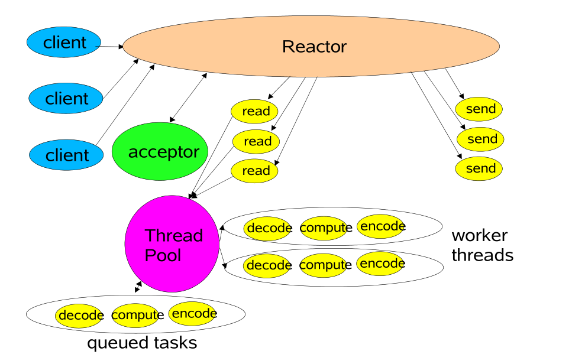

## 性能开销
- 应用程序通过系统调用从用户态转为内核态的开销；系统调用返回时从内核态转为用户态的开销。
- 网络数据从内核空间通过CPU拷贝到用户空间的开销。
网络数据包接收流程可以总结为两个阶段：
1. 数据准备阶段：网络数据包到`内核Socket`接收缓冲区的过程。
2. 数据拷贝阶段：当数据到达`内核Socket`的接收缓冲区中时，此时数据还存在于内核空间中，需要将数据拷贝到用户空间中，才能够被应用程序读取。

## 阻塞与非阻塞
> 阻塞与非阻塞的区别主要发生在：数据准备阶段。

当应用程序发起系统调用read时，线程从用户态转为内核态，读取内核Socket的接收缓冲区中的网络数据。
- 阻塞：如果这时内核Socket的接收缓冲区没有数据，那么线程就会一直等待，直到Socket接收缓冲区有数据为止。随后将数据从内核空间拷贝到用户空间，系统调用read返回。

- 非阻塞：当Socket的接收缓冲区中没有数据的时候，非阻塞模式下应用线程不会等待，系统调用直接返回错误标志。

##  同步与异步
>同步与异步主要的区别发生在第二阶段：数据拷贝阶段。

数据拷贝阶段主要是将数据从内核空间拷贝到用户空间。然后应用程序才可以读取数据。当内核Socket的接收缓冲区有数据到达时，进入数据拷贝阶段。
- 同步：同步模式在数据准备好后，是由用户线程的内核态来执行数据拷贝。所以应用程序会在这个阶段发生阻塞，直到数据从内核空间拷贝到用户空间，系统调用才会返回。

- 异步：异步模式下是由内核来执行数据拷贝，当内核拷贝完成后，会通知用户线程IO操作已经完成，并将数据回调给用户线程。所以在异步模式下的数据准备阶段和数据拷贝阶段均是由内核来完成的，不会对应用程序造成任何阻塞。

## IO模型
### 阻塞IO

阻塞读：当用户线程发起read系统调用，用户线程从用户态切换到内核态，在内核中去查看Socket接收缓冲区是否有数据到来。
- Socket接收缓冲区有数据，则用户线程在内核态将内核空间中的数据拷贝到用户空间，系统IO调用返回。
- Socket接收缓冲区没有数据，则用户线程让出CPU，进入阻塞状态。当数据到达Socket接收缓冲区后，内核唤醒阻塞状态中的用户线程进入就绪状态，随后经过CPU调用进入运行状态，将内核空间的数据拷贝到用户空间，随后系统调用返回。
阻塞写：当用户线程发起send系统调用时，用户线程从用户态切换到内核态，将发送数据从用户空间拷贝到内核空间中Socket发送缓冲区。
- 当Socket发送缓冲区能够容纳下发送数据时，用户线程会将全部的发送数据写入Socket缓冲区。
- 当Socket发送缓冲区空间不够，无法容纳下全部发送数据时，用户线程让出CPU，进入阻塞状态，直到Socket发送缓冲区能够容纳下全部发送数据时，内核唤醒用户线程，执行后续发送流程。

### 非阻塞IO

阻塞IO模型最大的问题就是第一个线程只能处理一个连接，如果这个链接上没有数据的话，那么这个线程就只能阻塞在系统IO调用上，不能干其他的事情。这对系统资源来说，是一种极大的浪费。同时大量的线程上下文切换，也是一个巨大的系统开销。
为了解决阻塞IO的问题，就需要用尽可能少的线程取处理更多的连接。
非阻塞读：
当用户线程发起非阻塞read系统调用时，用户线程从用户态转为内核态，在内核中去查看Socket接收缓冲区是否有数据到来。
- Socket接收缓冲区中无数据，系统调用立马返回。这个阶段用户线程不会阻塞，也不会让出CPU，而是会继续轮询直到Socket接收缓冲区有数据为止。
- Socket接收缓冲区中有数据，用户线程在内核态会将内核空间中的数据拷贝到用户空间，这个数据拷贝阶段，应用线程是会阻塞的，当数据拷贝完成，系统调用返回。
非阻塞写：
当发送缓冲区中没有足够的空间容纳全部发送数据时，非阻塞的特点是能写多少写多少，写不下了，就立即返回。并将写入到发送缓冲区的字节数返回给应用程序，方便用户线程不断地轮询尝试将剩下的数据写入发送缓冲区中。

### IO多路复用
>非阻塞IO模型仍然存在很大的性能问题，因为在非阻塞IO模型下，需要用户线程取不断地发起系统调用去轮询Socket接收缓冲区，这就需要用户线程不断地从用户态切换到内核态，内核态切换到用户态。

1. 多路：多路指的就是需要处理的众多连接。
2. 复用：有限的资源；多个连接可以复用一个独立的线程取处理这多个连接上的读写。
避免非阻塞IO模型中的频繁系统调用：
操作系统的支持：
- select
	select是操作系统内核提供的一个系统调用，它解决了非阻塞IO模型中需要不断的发起系统IO调用去轮询各个连接上的Socket接收缓冲区所带来的用户空间与内核空间不断切换的系统调用。
	
	select系统调用将轮询的操作交给了内核来完成，从而避免了在用户空间不断切换带来的系统开销。
	select的性能开销：
	- 发起select系统调用以及返回时，用户线程各发生了一次用户态到内核态以及内核态到用户态的上下文切换开销，发生了2次上下文切换。
	- 发起select系统调用以及返回时，用户线程在内核天需要将文件描述符集合从用户空间拷贝到内核空间。以及在内核修改完文件描述符集合后，又要将它从内核空间拷贝到用户空间，发生了2次文件描述符集合的拷贝。
	- 由原来的在用户空间发起轮询优化成了在内核空间发起轮询但select不会告诉用户线程到底是哪些Socket发生了IO就绪事件，只是对IO就绪的Socket作了标记，用户线程依然要遍历文件描述符集合去查找具体IO就绪的Socket，时间复杂度依然为O(n)。
	- 内核会对原始的文件描述符进行修改。导致每次在用户空间重新发起select调用时，都需要对文件描述符集合进行重置。
	- BitMap结构的文件描述符集合，长度为固定的1024，所以只能监听0~1023的文件描述符。
	- select系统调用不是线程安全的。
	
- poll
	poll相当于改进版的select，但是工作原理基本和select没有本质的区别。select中使用的文件描述符集合是采用固定长度为1024的BitMap结构的fd_set，而pool换成了poolfd结构没有固定长度的数组，这样就没有了最大描述符数量的限制（当然还会受到系统文件描述符限制）
- epoll
	epoll对select，poll的优化：
	- epoll在内核通过红黑树管理海量连接，所以在调用epoll_wait获取IO就绪的Socket时，不需要传入监听的Socket文件描述符，从而避免了海量的文件描述符集合在用户空间和内核空间中来回复制。
	- epoll仅会通知IO就绪的Socket，避免了在用户空间遍历的开销。
	- epoll通过在socket的等待队列上注册回调函数通知用户程序IO就绪的Socket，避免了在内核中轮询的开销。

## IO线程模型
### Reactor
> Reactor是利用NIO对IO线程进行不同的分工：
> 使用IO多路复用模型进行IO事件的注册和监听。
> 将监听到的就绪的IO事件分发dispatch到各个具体的处理Handler中进行相应IO事件处理。

###  单Reactor单线程
 >  单Reactor意味着只有一个epoll对象，用来监听所有的事件：连接事件、读写事件。
 >  单线程意味着只有一个线程来获取IO就绪的Socket，然后对这些就绪的Socket执行读写，以及后边的业务处理也依然是这个线程。

### 单Reactor多线程
>获取到IO就绪的Socket后，后面的业务Handler处理在线程池中进行。

### 主从Reactor多线程
> 主Reactor用来优先专门做优先级高的事情：处理连接事件。
>  当创建好连接，建立对应的Socket后，在acceptor中将要监听的read事件注册到Reactor中，由从Reactor来监听Socket上的读写事件。
>  最后将读写的业务逻辑处理交给线程池处理。

## Netty的IO线程模型
Netty对以上三种Reactor模型都是支持的，但是常用的是主从Reactor多线程模型。
Socket连接在创建后就被固定的分配给一个Reactor，所以一个Socket连接也只会被一个固定的IO线程执行，每个Socket连接分配一个独立的Pipeline实例，用来编排这个Socket连接上IO处理逻辑。无锁串行化，避免了线程安全问题。
由于每个Reactor中只有一个IO线程，这个IO线程既要执行IO活跃Socket连接对应的Pipeline中的ChannelHandler，又要从Reactor中获取IO就绪事件，执行IO调用，所以在Pipeline中ChannelHandler中执行的逻辑不能耗时太长，尽量将耗时的业务逻辑处理放入独立的业务线程池中处理，否则会影响其他连接的IO读写，从而影响整个服务的IO吞吐。
在从Reactor中，每个Reactor中都有一个selector，每个Reactor都有一个selector，每个Reactor负责处理多个channel的IO读写事件， 每个Channel只会被注册（绑定）到某一个Reactor上。
